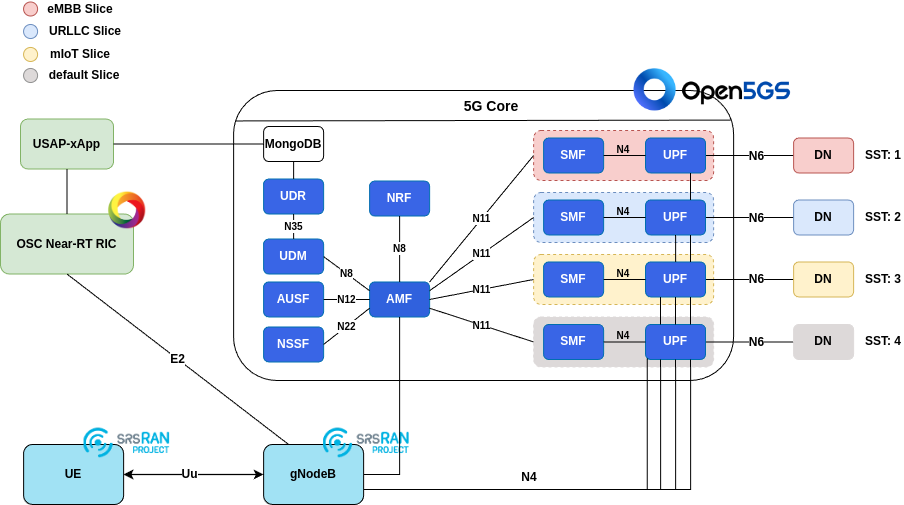

# UE Smart Allocation Platform on Open 5G Networks (USAP)

The UE Smart Allocation Platform on Open 5G Networks (USAP) is a project to manage and optimize the allocation of UEs and UE QoS, using slices on Open 5G Networks with support for the ORAN Alliance O-RAN standard.

<!-- ## Tutorials

### 5GC

1. [OAI-CN Deployment](docs/oai-cn/oai_cn_deploy.md)
2. [Open5GS-CN Deployment](docs/open5gs-cn/open5gs_deploy.md)

### RAN

1. [OAI-RAN gNB Deployment](docs/oai-ran/gnb_deploy.md)
2. [OAI-RAN NR-UE Deployment](docs/oai-ran/nr_ue_deploy.md)
3. [SRS-RAN 5G gNB + UE Deployment](./docs/srsran/srsran5g_zmq_deploy.md)

### RIC

1. [OSC Near-RT RIC Deployment](docs/osc-ric/osc_nrt_ric_deploy.md) -->

## Standardizations

Definitions used by the application to interact with the RIC

### E2SM standard

- [E2SM-v5.00](usap-e2sm/usap_e2sm/ans1/e2sm-v5.00.asn)
- [E2SM-KPM-v4.00](usap-e2sm/usap_e2sm/ans1/e2sm-kpm-v4.00.asn)
- [E2SM-RC-v5.00](usap-e2sm/usap_e2sm/ans1/e2sm-rc-v5.00.asn)

<!-- ### 3GPP NG Application Protocol (NGAP) Release 17

- [NGAP-CommonDataTypes](ngap/asn1/rel-18_2/NGAP-CommonDataTypes.asn)
- [NGAP-Constants](ngap/asn1/rel-18_2/NGAP-Constants.asn)
- [NGAP-Containers](ngap/asn1/rel-18_2/NGAP-Containers.asn)
- [NGAP-IEs](ngap/asn1/rel-18_2/NGAP-IEs.asn)
- [NGAP-PDU-Contents](ngap/asn1/rel-18_2/NGAP-PDU-Contents.asn)
- [NGAP-PDU-Descriptions](ngap/asn1/rel-18_2/NGAP-PDU-Descriptions.asn) -->

## Getting Started

### Requirements

- [Kubernetes Cluster](https://github.com/muriloAvlis/k8s-utils/blob/main/docs/cluster_deploy/kubeadm/install.md)
- [Open5gs 5GC](./charts/open5gs/README.md)
- [OSC Near-RT RIC](./docs/osc-ric/osc_nrt_ric_deploy.md)
- SRSRAN 5G RAN

### Network Configurations

The following 5G slice configurations were used for our experiments:

|                    | **sst** | **sd** | **dnn** | **Subnet**  | **MCC** | **MNC** |
|--------------------|---------|--------|---------|-------------|---------|---------|
| **embb_slice**     | 1       | FFFFFF | embb    | 10.45.0.0/24 |   001   |   01    |
| **urllc_slice**    | 2       | FFFFFF | urllc   | 10.45.1.0/24 |   001   |   01    |
| **miot_slice**     | 3       | FFFFFF | miot    | 10.45.2.0/24 |   001   |   01    |
| **default_slice**  | 128     | FFFFFF | default | 10.45.3.0/24 |   001   |   01    |

### Deployment

```sh
helm upgrade --install usap -n ricxapp deployments/helm-chart -f deployments/helm-chart/values.yaml
```

### Proposal topology



### How It Works

TODO