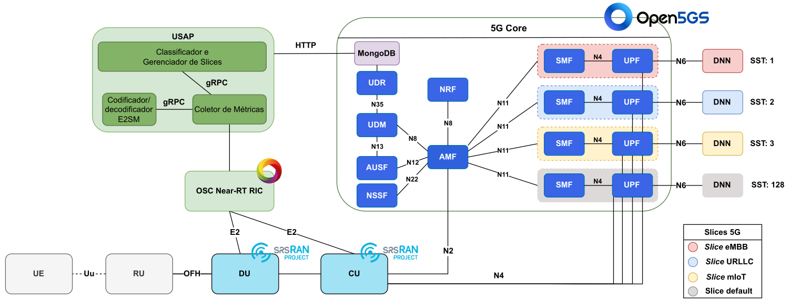

# UE Smart Allocation Platform on Open 5G Networks (USAP)

The UE Smart Allocation Platform on Open 5G Networks (USAP) is a project to manage and optimize the allocation of UEs and UE QoS, using slices on Open 5G Networks with support for the ORAN Alliance O-RAN standard.

## Modules

- 5GC Slice Manager (muriloavlis/usap-sm) - Ok
- KPM Monitor (muriloavlis/usap-xapp) - in development
- UE's slice classifier (muriloavlis/usap-ai) - TODO

## Getting Started

### Requirements

- Kubernetes Cluster (tutorial on [K8s Installation Using Kubeadm](https://github.com/muriloAvlis/k8s-utils/blob/main/docs/cluster_deploy/kubeadm/install.md))
- OAI-5G Core
- FlexRIC
- OAI-5G RAN

### Build Docker Image

```sh
docker image build -t muriloavlis/usap:latest -f docker/Dockerfile.usap .
```

### Network Slicing Configuration

#### NFs

|                    | **SST** | **SD** |
|--------------------|---------|--------|
| **SMF/UPF-eMBB**     | 1       | 0x1  | 
| **SMF/UPF-URLLC**    | 2       | 0x1  |
| **SMF/UPF-mIoT**     | 3       | 0x1  |
| **SMF/UPF-default**  | 4       | 0x1  |

#### Service Types 

|                    | **SST** | **SD** | **DNN** | **Subnet**  | **MCC** | **MNC** |
|--------------------|---------|--------|---------|-------------|---------|---------|
| **embb_slice**     | 1       | 000001 | internet  | 10.45.0.0/24 |   724   |   70    |
| **urllc_slice**    | 2       | 000001 | internet  | 10.45.1.0/24 |   724   |   70    |
| **miot_slice**     | 3       | 000001 | internet  | 10.45.2.0/24 |   724   |   70    |
| **default_slice**  | 4       | 000001 | internet  | 10.45.3.0/24 |   724   |   70    |

### Proposal topology



### xApp Fluxogram

TODO

### How It Works

TODO